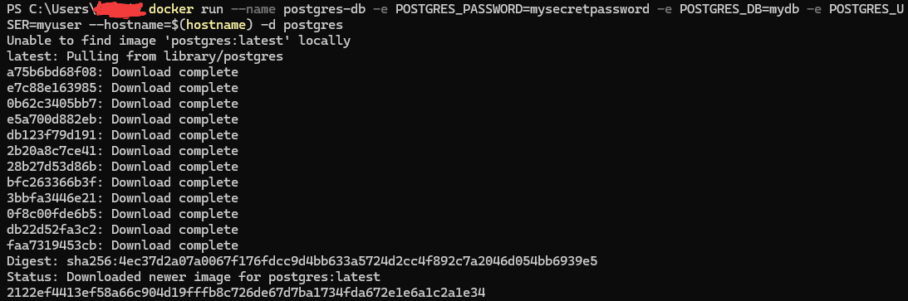
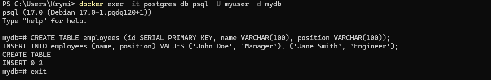
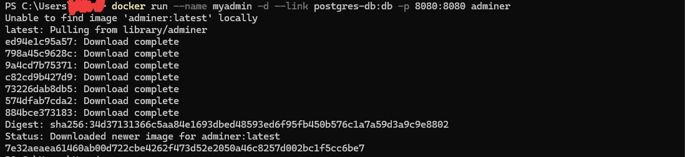
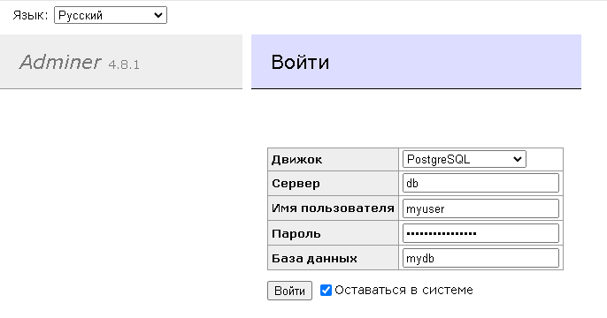
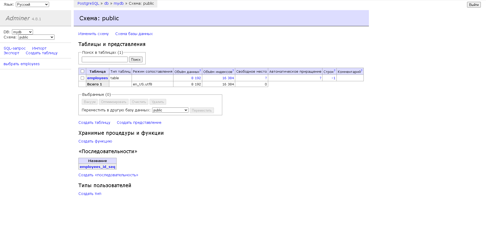

Запуск контейнера с БД (не MariaDB): Например, используем контейнер с PostgreSQL. 

`docker run --name postgres-db -e POSTGRES_PASSWORD=mysecretpassword -e POSTGRES_DB=mydb -e POSTGRES_USER=myuser --hostname=$(hostname) -d postgres`

- POSTGRES_PASSWORD=mysecretpassword — пароль для пользователя.
- POSTGRES_DB=mydb — имя создаваемой базы данных.
- POSTGRES_USER=myuser — пользователь базы данных.
- --hostname=$(hostname) — использование системного hostname через переменную.

Заполнение базы данных данными через консоль

`docker exec -it postgres-db psql -U myuser -d mydb`

PostgreSQL - SQL-запрос

```SQL
CREATE TABLE employees (id SERIAL PRIMARY KEY, name VARCHAR(100), position VARCHAR(100));
INSERT INTO employees (name, position) VALUES ('John Doe', 'Manager'), ('Jane Smith', 'Engineer');
```

Запуск phpMyAdmin

Скриншоты 

1. Запуск контейнера с БД (не MariaDB): Например, используем контейнер с PostgreSQL.



2. Заполнение базы данных данными через консоль



3. Запуск phpMyAdmin



Вход в админку http://localhost:8080

* Сервер: db
* Пользователь: myuser
* Пароль: mysecretpassword
* База данных: mydb



4. Проверка данных через веб-интерфейс



